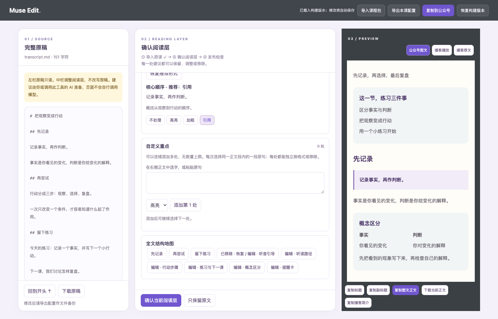

# Muse Edit

**把一份课程逐字稿，变成可以审、可以改、可以直接发布的公众号图文与播客材料。**

很多课程内容不是写得不好，而是发布时只剩一整屏逐字稿：读者抓不住重点，编辑又不敢让 AI 改坏原意。Muse Edit 在原稿外增加一层可撤销的阅读设计——听读路径、概念卡、行动步骤、提醒、练习和重点表达——再把确认后的内容打包成公众号与播客发布材料。



左边是锁定的完整原稿，中间决定增加哪些阅读层，右边实时看到发布效果。点击中间的模块，右侧会自动定位到对应内容；不满意可以修改、关闭或恢复建议。

## 它能帮你完成什么

给它逐字稿，并按需提供音频和两类封面，它会生成一个可在浏览器中继续编辑的课程包：

```text
逐字稿 + 音频 + 封面
          ↓
   AI 提出阅读层建议
          ↓
你在三栏工作台逐项确认和精修
          ↓
公众号图文 + 播客简介 + 原稿/章节校对稿 + 全部素材
```

- 完整保留原稿，不改写、删减或移动课程正文。
- 阅读层按原文锚点插入，每个模块都能编辑、关闭、恢复和定位预览。
- AI 推荐重点与自定义重点分开管理；可连续添加多处，逐条选择高亮、加粗、引用或不处理。
- 同时管理公众号封面、播客方形封面、音频和配套文章链接。
- 分别预览公众号图文、播客播放页和播客原文，并导出对应发布材料。
- 修改自动保存在当前浏览器；课程配置可导出、重新导入和再次构建。

## 30 秒体验

需要 Node.js 22+，演示构建不需要安装 npm 依赖：

```bash
git clone https://github.com/heyuxuan0209/muse-edit-skill.git
cd muse-edit-skill
node skills/muse-edit/scripts/muse.mjs build \
  --course examples/demo.course.json \
  --source examples/transcript.md \
  --out output/demo
open output/demo/index.html
```

最后一行适用于 macOS；其他系统直接用浏览器打开 `output/demo/index.html`。演示使用虚构短课，不包含真实音频、品牌图片或私人内容。页面会如实显示哪些素材尚未提供。

## 作为 Codex Skill 使用

把 `skills/muse-edit` 复制到你的 Codex skills 目录：

```bash
mkdir -p ~/.codex/skills/muse-edit
cp -R skills/muse-edit/. ~/.codex/skills/muse-edit/
```

开启新会话后，可以直接说：

> 用 $muse-edit，把这份逐字稿和音频做成课程图文与播客发布包。保留原稿，完成后打开工作台让我检查。

Codex 会读取材料、准备课程配置、校验原稿和素材、生成发布目录并打开工作台。页面本身不会调用模型，也不会把内容上传到外部服务。

其他支持 `SKILL.md` 的 Agent，也可以把同一目录安装为技能。

## 处理自己的课程

### 从逐字稿开始

```bash
node skills/muse-edit/scripts/muse.mjs init \
  --source /path/to/transcript.md \
  --title "课程标题" \
  --id lesson-01 \
  --out output/lesson-source \
  --audio /path/to/audio.mp3 \
  --article-cover /path/to/article-cover.png \
  --podcast-cover /path/to/podcast-cover.png
```

`init` 会保留原稿并创建待编辑的 `course.json`。让 Agent 按原稿补充阅读层建议后，再构建发布包：

```bash
node skills/muse-edit/scripts/muse.mjs build \
  --course output/lesson-source/course.json \
  --source /path/to/transcript.md \
  --out output/lesson-release \
  --require-assets
```

### 从现有 Muse 课程包开始

它兼容 Muse 课程 JSON `1.0`。可以在工作台顶部点击“导入课程包”，也可以直接运行：

```bash
node skills/muse-edit/scripts/muse.mjs build \
  --course /path/to/lesson.course.json \
  --assets /path/to/project-root \
  --out output/lesson-release \
  --require-assets
```

当 JSON 中的图片和音频路径相对于另一个项目目录时，用 `--assets` 指向素材根目录。若本机已有 gzh-design 校验器，还可添加：

```bash
--validator /path/to/gzh-design/scripts/validate_gzh_html.py
```

## 你会得到什么

每次构建都会生成一个可整体迁移的目录：

| 文件 | 用途 |
|---|---|
| `index.html` | 三栏工作台，也是主要入口 |
| `course.json` | 可重新导入的课程配置 |
| `article.html` | 构建时的干净公众号正文 |
| `title.txt` | 公众号标题 |
| `podcast-notes.txt` | 轻量播客简介与配套文章入口 |
| `transcript.md` | 完整原稿副本 |
| `transcript-review.txt` | 章节标题与转写校对稿，不伪造时间码 |
| `assets/` | 音频与封面 |
| `validation.json` | 原稿、结构和素材检查结果 |

在浏览器里修改后，“导出本课配置”保存最新配置，“下载当前正文”取得最新 HTML。目录中的 `article.html` 是构建那一刻的快照；要生成一套更新后的完整目录，请用导出的 JSON 再执行一次 `build`。

## Muse Edit 和 gzh-design 的关系

Muse Edit 适合有原稿、有音频、有固定课程结构的内容：重点是保护原稿、设计阅读路径和准备双发布材料。

gzh-design 更适合普通公众号文章的多主题自动排版。Muse Edit 不会把 gzh-design 已排好的 HTML 转回 Markdown，也没有复制它的主题库；需要自由换主题时，应直接使用 gzh-design。

## 当前边界

- 图文和播客需要分别发布；原生音频、转写和时间轴不会随公众号 HTML 一起复制。
- 工具不会登录或发布到公众号，也不保证微信平台二次清洗后的最终样式；发布前仍要检查手机预览。
- 浏览器草稿保存在当前设备和当前页面路径，不跨设备同步。导出的课程配置才是可迁移备份。
- 主要支持标题、段落、粗体、分隔线和围栏代码等逐字稿 Markdown 子集。复杂表格、内嵌 HTML、图片和链接需要单独检查。
- 当前工作台是从原 Muse 课程原型提炼的独立实现，功能流程已覆盖，但编辑提交方式和部分视觉细节并非像素级复刻。完整差异见 [一致性排查](AUDIT-PARITY.md)。

## 质量状态

当前版本已覆盖连续添加 20 处自定义重点、浏览器草稿恢复、课程导入导出、真实剪贴板 HTML、封面替换、移动端布局和异常输入保护。总览课与第 1—6 课曾使用真实素材做本地验证；仓库只保留合成示例和工具代码。

开发验证：

```bash
npm ci
npm test
npx playwright install chromium
npm run test:browser
```

详细检查范围见 [VERIFICATION.md](VERIFICATION.md)。

## 隐私说明

仓库不包含真实课程、音频、品牌人物或私人路径。浏览器测试只使用合成内容，不连接知识库、公众号或付费模型。真实内容是否交给 Agent 处理、保存或发布，由内容所有者决定。
